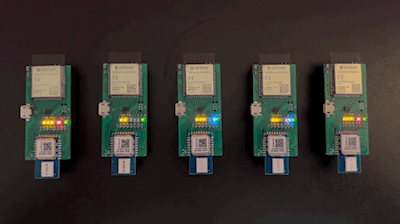

# Positioning via IMU-aided WiFi FTM and UWB on an ESP32-S3

## Overview

There is ample research into the accuracy of Ulra Wideband (UWB)-based ranging and positioning, WiFi Fine Timing Measurements (WiFi FTM)-based ranging and positioning, and an Inertial Measurement Unit (IMU) augmentation of such systems.  Most of the work was performed with purpose-designed systems or smartphones, but very little was performed using Espressif SoCs including the ESP32-S3.

Based on the findings of previous works, it's expected that WiFi FTM may be only valuable for positioning information to about 1 meter accuracy while UWB sensors can provide measurements accurate down to around 10 centimeters.  UWB has limited range, particularly in indoor and cluttered environments where the signals fail to penetrate through walls or other obstacles.  This suggests that if accuracy is a requirement, it may be required to install a UWB transciever but also utilize WiFi FTM to provide rough positioning should the UWB signal be lost.

Sensor fusion and state estimation through Kalman filtering can provide better positioning estimates over naive approaches using WiFi FTM, UWB, or IMU measurements alone.  Previous research have been performed using Extended Kalman Filtering (EKF) and Unscented Kalman Filter (UKF) approaches, but publications for Invariant Extended Kalman Filter (InEKF) have not been identified.

### Questions

1. Given the utility for low-cost, low-power, and reduced bill-of-materials positioning for small, low-cost robots, can we use the ESP32-S3's WiFi Fine Timing Measurements (WiFi FTM) in 802.11mc standard and an IMU for positioning without additional sensors?

2. Will the inclusion of a UWB sensor bring sufficient value to offset their additional cost, complexity, and power consumption?

3. Can the redundancy in Time Difference of Arrival (TDOA) measurements from WiFi FTM and UWB be used to improve accuracy beyond either WiFi FTM or UWB alone?

## Objective

This experiment is to compare and contrast position estimation of systems:

    1. IMU and WiFi FTM
    2. IMU and UWB
    3. IMU with WiFi FTM and UWB

## Experiment Design

To perform this experiment, a custom design was created using:

* Espressif ESP32-S3-WROOM-2 module
* STMicroelectronics ISM330DHCX IMU
* Qorvo DWM1000 UWB module
* 2 AAA battery holder

Circuit Diagram and PCB Layout can be found in the [`kicad/`](kicad/) directory.
